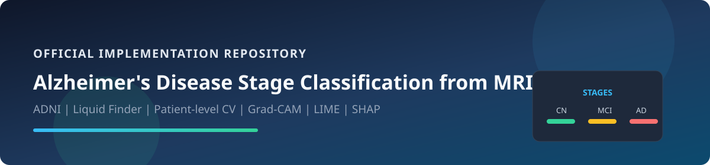
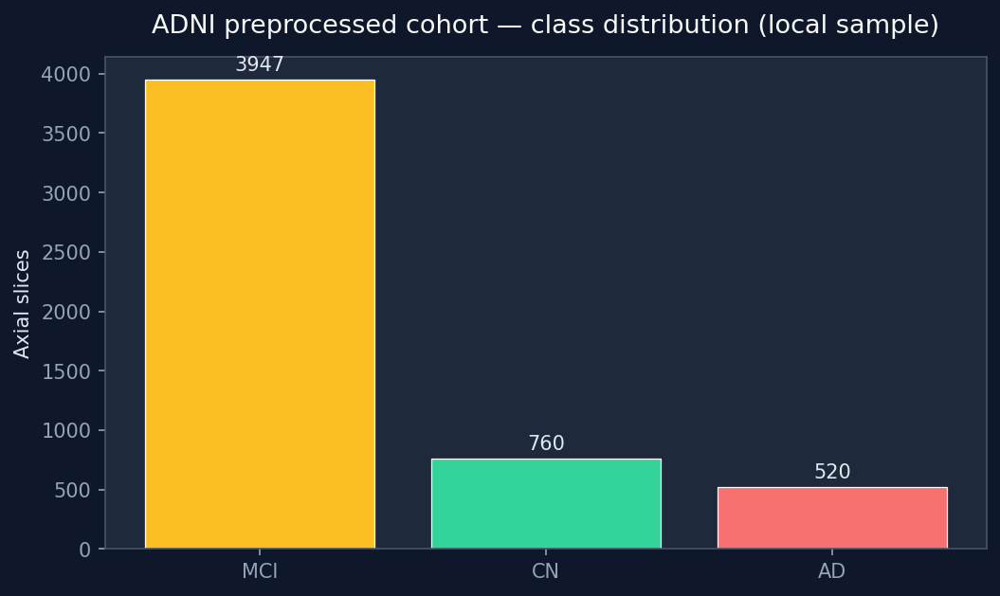
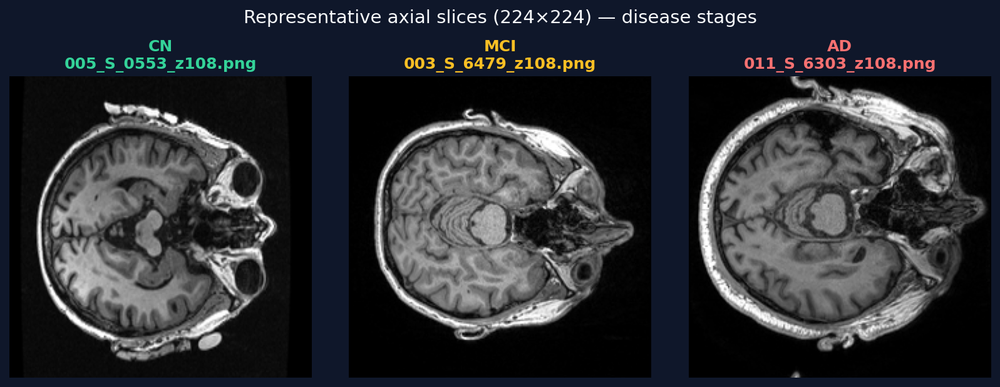
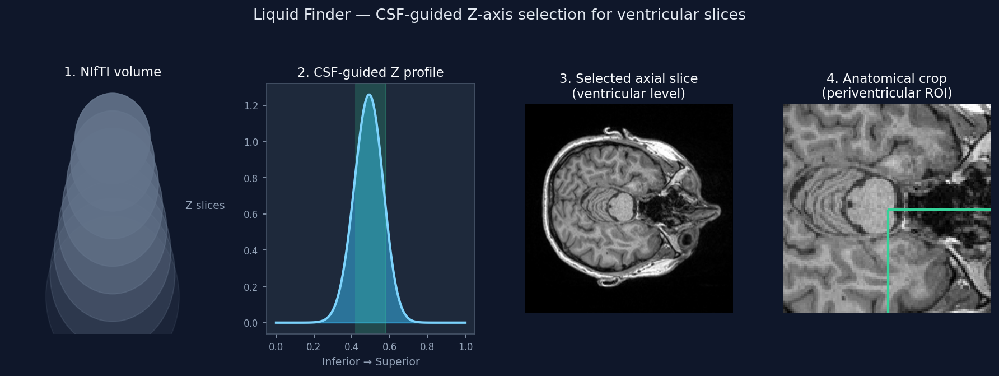
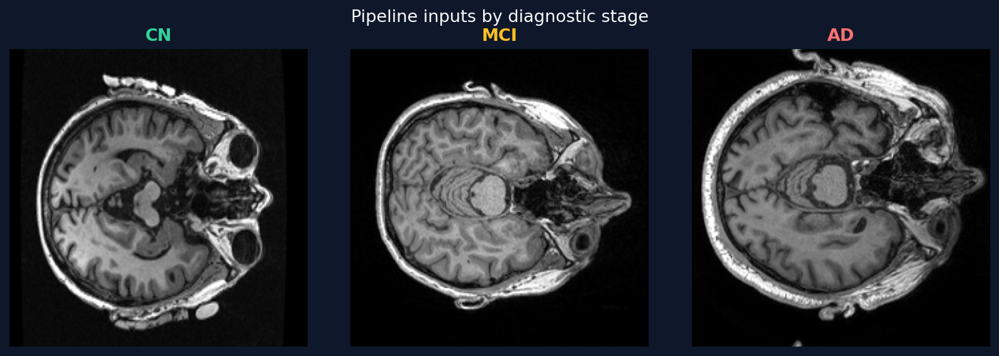
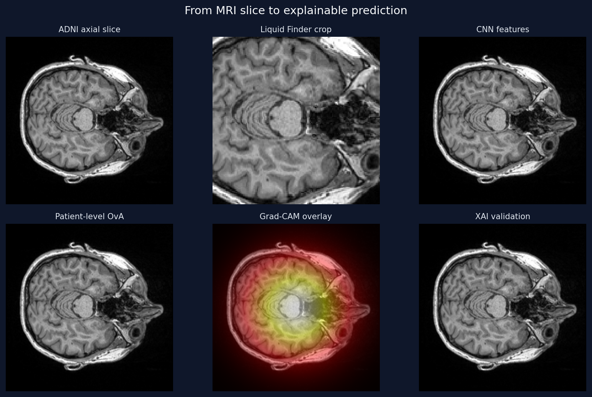
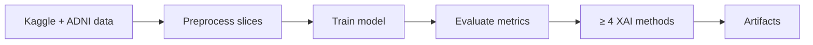

<p align="center">
  
</p>

<h1 align="center">Explainable AI for Alzheimer's Disease Stage Classification from MRI</h1>

<p align="center">
  <strong>Manuscript in preparation, 2026</strong><br/>
  Structural MRI · multiclass staging (<code>CN</code> · <code>MCI</code> · <code>AD</code>) · companion code &amp; experiments
</p>

<p align="center">
  
  
  
  
  
  
  
  
</p>

<p align="center">
  <a href="#manuscript">📄 Manuscript</a> ·
  <a href="#how-to-cite">Cite</a> ·
  <a href="#overview">Overview</a> ·
  <a href="#pipeline">Pipeline</a> ·
  <a href="#notebooks">Notebooks</a> ·
  <a href="#quick-start">Quick start</a> ·
  <a href="docs/ARCHITECTURE.md">Architecture</a>
</p>

---

## Manuscript

> **Work in progress.** Methods, benchmarks, and scientific claims are defined in the **draft manuscript** below—not in this README alone. This repository is companion code; the paper is **not yet published**.

| | |
|---|---|
| **Title** | Explainable AI for Alzheimer's Disease Stage Classification from MRI |
| **Authors** | Omar Zayed · Ahmed Moatasem · Malak Khaled · Farida Ali |
| **Affiliation** | Department of Computational Science and Artificial Intelligence, **Zewail City of Science and Technology**, Cairo, Egypt |
| **Status** | **Manuscript in preparation, 2026** (draft dated May 2026) |
| **Draft PDF** | [**Download current draft**](docs/reports/Explainable%20AI%20for%20AD%20Stage%20Classification.pdf) |

**Contributions:** (1) **Liquid Finder** — CSF-guided Z-axis cropping for ventricular axial slices; (2) **Evaluation audit** — controlled slice-level vs. patient-level splits on ADNI (*n*=320); (3) **Honest OvA benchmarks** — ResNet-50 ensemble: AD 83.3%, CN 80.0%, MCI 60.0%; (4) **Clinical XAI validation** — Grad-CAM, LIME, SHAP align with periventricular biomarkers.

⚠️ **The manuscript is © the authors, all rights reserved.** You may read and cite it; you may **not** redistribute, rehost, or plagiarize it. See [docs/reports/COPYRIGHT.md](docs/reports/COPYRIGHT.md) and [NOTICE.md](NOTICE.md).

---

## How to cite

```bibtex
@article{zayed2026explainable,
  title   = {Explainable {AI} for {Alzheimer's} Disease Stage Classification from {MRI}},
  author  = {Zayed, Omar and Moatasem, Ahmed and Khaled, Malak and Ali, Farida},
  year    = {2026},
  month   = {5},
  note    = {Manuscript in preparation, 2026. Department of Computational Science and Artificial Intelligence, Zewail City of Science and Technology, Cairo, Egypt}
}
```

- BibTeX file: [`docs/reports/citation.bib`](docs/reports/citation.bib)  
- GitHub citation metadata: [`CITATION.cff`](CITATION.cff)

---

## Overview

This repository holds **companion code and notebooks** for our manuscript in preparation (2026). It contains **17 reproducible experiments** (plus preprocessing & EDA notebooks) that classify Alzheimer's disease stage from structural MRI slices. Each notebook trains (or fine-tunes) a model, evaluates on held-out patients or scans, and applies **at least four explainability techniques**—Grad-CAM, LIME, SHAP, Integrated Gradients, Captum, saliency maps, and more.

| Label | Meaning |
|-------|---------|
| **CN** | Cognitively Normal |
| **MCI** | Mild Cognitive Impairment |
| **AD** | Alzheimer's Disease |

### Authors & experiments

| Author | Research focus | Implementation notebooks |
|--------|-------|-----------|
| **Omar Zayed** | Hybrid & ensemble CNNs | ConvMixer+RF, ResNet-50, SE-CNN+RF |
| **Farida Ali** | Classical + custom CNNs | AlexNet+SVM, Custom CNN, DAD-Net |
| **Malak Khaled** | VGG & dual-branch | VGG19+SVM (patient & scan), Dual CNN, DenseNet |
| **Ahmed Moatasem** | EfficientNet & transfer | EfficientNet K-Fold/Multiclass, HTLML, hybrids, cross-dataset |

---

## Visual overview

### ADNI cohort & disease stages

Exploratory slice counts and representative **CN / MCI / AD** axial inputs (224×224). Full EDA: [`notebooks/preprocessing/eda-adni.ipynb`](notebooks/preprocessing/eda-adni.ipynb).

<p align="center">
  
  &nbsp;
  
</p>

### Liquid Finder preprocessing

**Liquid Finder** uses a CSF intensity profile along the Z axis to select axial slices at the **lateral ventricles**, reducing skull/artifact shortcuts and aligning inputs with periventricular atrophy biomarkers (see manuscript §3).

<p align="center">
  
</p>

### Pipeline: slices → model → explanations

<p align="center">
  
</p>

<p align="center">
  
</p>

> Figures generated from local ADNI samples via `python scripts/generate_readme_figures.py`. Grad-CAM/LIME/SHAP panels in notebooks use the same ventricular regions.

---

## Pipeline

<p align="center">
  
</p>

Every notebook follows the same research pipeline:



Detailed diagrams and sequence charts: **[docs/ARCHITECTURE.md](docs/ARCHITECTURE.md)** · Runbook: **[docs/PIPELINE.md](docs/PIPELINE.md)**

---

## Repository structure

<p align="center">
  
</p>

```
.
├── assets/                    # SVG diagrams + figures/ (PNG gallery)
├── docs/
│   ├── ARCHITECTURE.md        # System & XAI architecture
│   ├── PIPELINE.md            # Kaggle runbook
│   └── reports/               # Manuscript & supplementary PDFs
├── notebooks/
│   ├── preprocessing/         # EDA & Liquid Finder pipeline
│   ├── omar_zayed/
│   ├── farida_ali/
│   ├── malak_khaled/
│   └── ahmed_moatasem/
├── data/                      # Optional local slices (see data/README.md)
├── requirements.txt
├── CONTRIBUTING.md
└── README.md
```

---

## Notebooks

Paths are relative to `notebooks/`. Each file is **self-contained** on Kaggle.

### Preprocessing & EDA

| Notebook | Description |
|----------|-------------|
| [`preprocessing/team09_preprocessing.ipynb`](notebooks/preprocessing/team09_preprocessing.ipynb) | Liquid Finder & preprocessing pipeline |
| [`preprocessing/eda-adni.ipynb`](notebooks/preprocessing/eda-adni.ipynb) | Exploratory ADNI analysis |

### Omar Zayed

| Notebook | Model | XAI |
|----------|-------|-----|
| [`omar_zayed/Team_09_ConvMixer_RF_Omar_Zayed.ipynb`](notebooks/omar_zayed/Team_09_ConvMixer_RF_Omar_Zayed.ipynb) | ConvMixer + Random Forest | Grad-CAM, LIME, SHAP, Occlusion |
| [`omar_zayed/Team_09_ResNet50_Omar_Zayed.ipynb`](notebooks/omar_zayed/Team_09_ResNet50_Omar_Zayed.ipynb) | ResNet-50 (K-Fold, 1-vs-All) | Grad-CAM, LIME, SHAP, Integrated Gradients |
| [`omar_zayed/Team_09_SE_CNN_RF_Omar_Zayed.ipynb`](notebooks/omar_zayed/Team_09_SE_CNN_RF_Omar_Zayed.ipynb) | SE-CNN + Random Forest | Grad-CAM, LIME, SHAP, Feature importance |

### Farida Ali

| Notebook | Model | XAI |
|----------|-------|-----|
| [`farida_ali/Team_09_AlexNet_SVM_Farida_Ali.ipynb`](notebooks/farida_ali/Team_09_AlexNet_SVM_Farida_Ali.ipynb) | AlexNet + SVM | Grad-CAM, LIME, SHAP, Occlusion |
| [`farida_ali/Team_09_CNN_Farida_Ali.ipynb`](notebooks/farida_ali/Team_09_CNN_Farida_Ali.ipynb) | Custom CNN | Grad-CAM, LIME, SHAP, IG, Captum |
| [`farida_ali/Team_09_DAD_Net_Farida_Ali.ipynb`](notebooks/farida_ali/Team_09_DAD_Net_Farida_Ali.ipynb) | DAD-Net | Grad-CAM, LIME, IG, Saliency, SmoothGrad, Captum |

### Malak Khaled

| Notebook | Model | XAI |
|----------|-------|-----|
| [`malak_khaled/Team_09_VGG19_SVM_PatientLevel_Malak_Khaled.ipynb`](notebooks/malak_khaled/Team_09_VGG19_SVM_PatientLevel_Malak_Khaled.ipynb) | VGG-19 + SVM (patient) | Grad-CAM, LIME, SHAP, IG, Saliency |
| [`malak_khaled/Team_09_VGG19_SVM_ScanLevel_Malak_Khaled.ipynb`](notebooks/malak_khaled/Team_09_VGG19_SVM_ScanLevel_Malak_Khaled.ipynb) | VGG-19 + SVM (scan) | Grad-CAM, LIME, SHAP, Saliency, Captum |
| [`malak_khaled/Team_09_DualCNN_Malak_Khaled.ipynb`](notebooks/malak_khaled/Team_09_DualCNN_Malak_Khaled.ipynb) | Dual-branch CNN | Grad-CAM, LIME, Occlusion, Saliency |
| [`malak_khaled/Team_09_DenseNet_Multiclass_Malak_Khaled.ipynb`](notebooks/malak_khaled/Team_09_DenseNet_Multiclass_Malak_Khaled.ipynb) | DenseNet-121 | Grad-CAM, LIME, SHAP, IG, Captum |

### Ahmed Moatasem

| Notebook | Model | XAI |
|----------|-------|-----|
| [`ahmed_moatasem/Team_09_EfficientNetB0_KFold_Ahmed_Moatasem.ipynb`](notebooks/ahmed_moatasem/Team_09_EfficientNetB0_KFold_Ahmed_Moatasem.ipynb) | EfficientNet-B0 K-Fold | Grad-CAM, LIME, SHAP, IG |
| [`ahmed_moatasem/Team_09_EfficientNetB0_Multiclass_Ahmed_Moatasem.ipynb`](notebooks/ahmed_moatasem/Team_09_EfficientNetB0_Multiclass_Ahmed_Moatasem.ipynb) | EfficientNet-B0 multiclass | Grad-CAM, LIME, SHAP, IG, Captum |
| [`ahmed_moatasem/Team_09_HTLML_Hybrid_Ahmed_Moatasem.ipynb`](notebooks/ahmed_moatasem/Team_09_HTLML_Hybrid_Ahmed_Moatasem.ipynb) | HTLML hybrid | Grad-CAM, LIME, SHAP, IG, Captum |
| [`ahmed_moatasem/Team_09_ResNet18_DenseNet121_Hybrid_Ahmed_Moatasem.ipynb`](notebooks/ahmed_moatasem/Team_09_ResNet18_DenseNet121_Hybrid_Ahmed_Moatasem.ipynb) | ResNet-18 + DenseNet-121 | Grad-CAM, LIME, SHAP, IG, Captum |
| [`ahmed_moatasem/Team_09_VGG16_SVM_Binary_Ahmed_Moatasem.ipynb`](notebooks/ahmed_moatasem/Team_09_VGG16_SVM_Binary_Ahmed_Moatasem.ipynb) | VGG-16 + SVM (binary) | Grad-CAM, LIME, SHAP, Permutation importance |
| [`ahmed_moatasem/Team_09_Kaggle_ADNI_Transfer_Learning_Ahmed_Moatasem.ipynb`](notebooks/ahmed_moatasem/Team_09_Kaggle_ADNI_Transfer_Learning_Ahmed_Moatasem.ipynb) | Transfer learning | Grad-CAM, LIME, SHAP, IG |
| [`ahmed_moatasem/Team_09_Cross_Dataset_Validation_Ahmed_Moatasem.ipynb`](notebooks/ahmed_moatasem/Team_09_Cross_Dataset_Validation_Ahmed_Moatasem.ipynb) | Cross-dataset validation | Grad-CAM, LIME, SHAP, IG |

---

## Quick start

### On Kaggle (recommended)

1. Upload or fork a notebook from `notebooks/<author>/`.
2. **Settings → Accelerator → GPU** (T4 or P100).
3. **Settings → Internet → On** (for `pip` and `gdown`).
4. **Add Data**:
   - Public: `aryansinghal10/alzheimers-multiclass-dataset-equal-and-augmented`
   - ADNI: private dataset **or** automatic `gdown` in setup cells
5. **Run All**.

### Local

```bash
pip install -r requirements.txt
jupyter lab notebooks/
```

For CUDA wheels, see [PyTorch install docs](https://pytorch.org/get-started/locally/).

---

## Dataset

| Source | Role |
|--------|------|
| [Kaggle multiclass MRI](https://www.kaggle.com/datasets/aryansinghal10/alzheimers-multiclass-dataset-equal-and-augmented) | Public augmented slices |
| ADNI `adni_nifti_preprocessed` | NIfTI volumes → axial slices (`CN` / `MCI` / `AD`) |

Local sample layout: [`data/README.md`](data/README.md).

---

## Manuscript & legal

| Document | License |
|----------|---------|
| [**Manuscript (PDF)**](docs/reports/Explainable%20AI%20for%20AD%20Stage%20Classification.pdf) | © authors — [all rights reserved](docs/reports/COPYRIGHT.md) |
| [Supplementary technical report (PDF)](docs/reports/Team9_Phase1.pdf) | © authors — supplementary material |
| Implementation (notebooks & code) | [MIT](LICENSE) |

Full details: [docs/reports/README.md](docs/reports/README.md) · [NOTICE.md](NOTICE.md)

---

## License

| Component | Terms |
|-----------|--------|
| **Software & notebooks** | [MIT License](LICENSE) — Copyright (c) 2026 Omar Zayed, Ahmed Moatasem, Malak Khaled, Farida Ali |
| **Manuscript (PDF)** | **All rights reserved** — see [COPYRIGHT.md](docs/reports/COPYRIGHT.md) |
