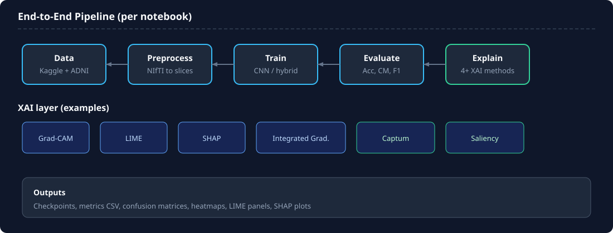
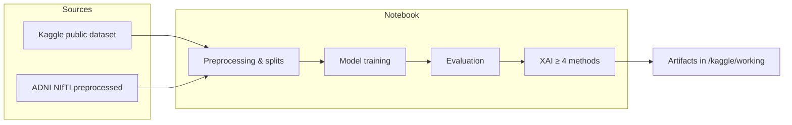
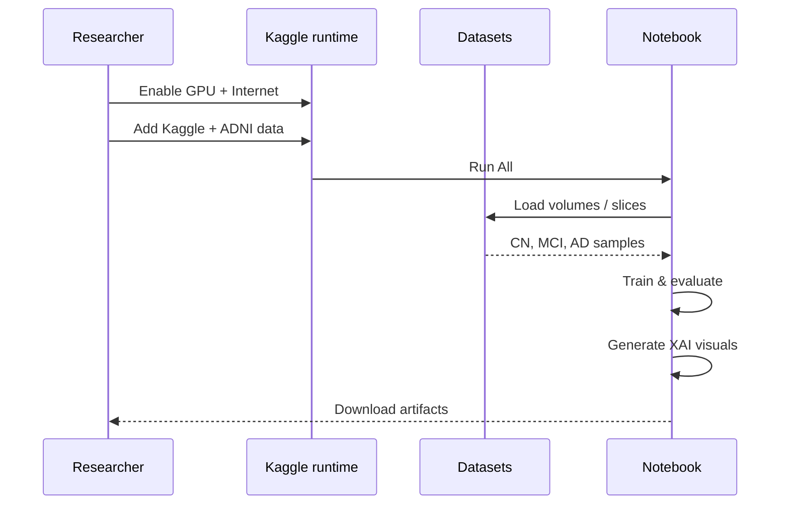
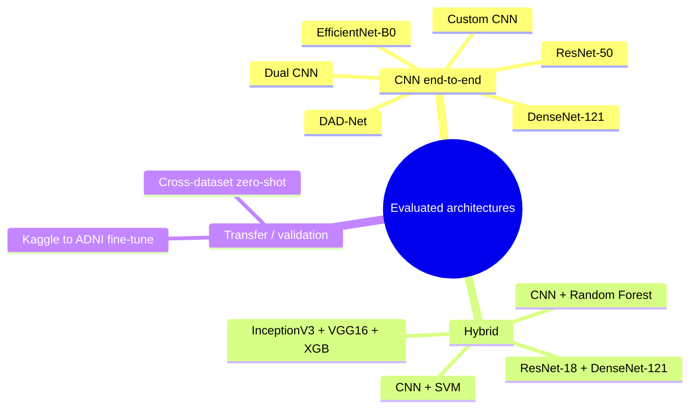

# Architecture & pipelines

This document describes how the implementation notebooks are structured and how data flows through the experimental pipeline described in *Zayed et al. (2026)*.

## System overview

## Per-notebook pipeline

Each experiment notebook is **self-contained** and follows the same stages:

| Stage | Description | Typical outputs |
|-------|-------------|-----------------|
| **1. Environment** | `pip install`, seed, device (CUDA) | — |
| **2. Data ingest** | Attach Kaggle datasets or `gdown` ADNI zip | `ADNI_DIR`, class folders |
| **3. Preprocessing** | Resize, normalize, slice extraction, patient-level splits | `preprocessed/` PNG folders |
| **4. Training** | CNN fine-tune, hybrid features + classical ML, or K-fold | checkpoints, `.pth` |
| **5. Evaluation** | Accuracy, confusion matrix, classification report | CSV, plots |
| **6. Explainability** | Grad-CAM, LIME, SHAP, IG, Captum, etc. | heatmaps, attribution plots |

## Model families

## XAI stack

| Method | Type | Typical use |
|--------|------|-------------|
| **Grad-CAM** | CNN activation maps | Which regions drove the class |
| **LIME** | Local surrogate | Interpret single slice |
| **SHAP** | Shapley values | Feature / pixel importance |
| **Integrated Gradients** | Path attribution | Deep model sensitivity |
| **Captum** | PyTorch attributions | Occlusion, IG variants |
| **Saliency / SmoothGrad** | Gradient-based | Fine-grained maps |
| **Occlusion** | Perturbation | Region necessity |

Hybrid notebooks (CNN + RF/SVM) combine **deep saliency** with **classical feature importance** where applicable.

## Classification target

| Label | Clinical meaning |
|-------|------------------|
| `CN` | Cognitively Normal |
| `MCI` | Mild Cognitive Impairment |
| `AD` | Alzheimer's Disease |

Some notebooks use **patient-level** aggregation (vote across slices); others use **scan-level** labels.

## Related documents

- [Pipeline details](./PIPELINE.md) — step-by-step runbook
- [Publications](./reports/) — manuscript & supplementary PDFs
- [Main README](../README.md) — quick start & notebook index
