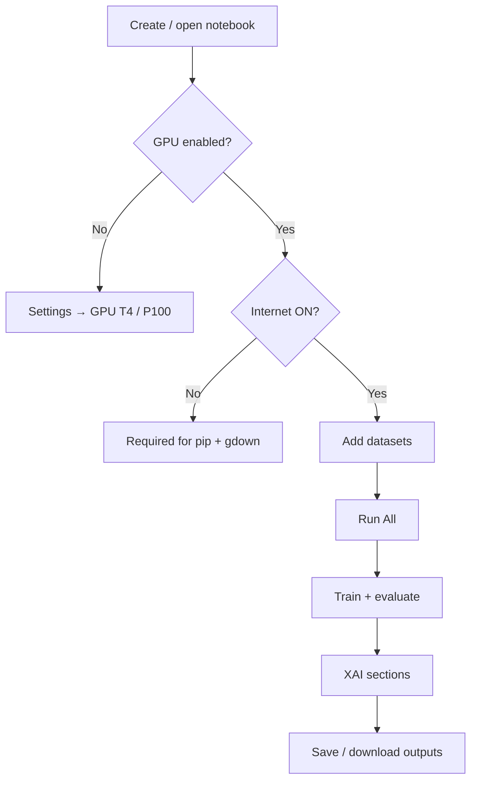

# Reproducibility runbook

Steps to reproduce experiments from our manuscript in preparation (2026).

## Kaggle execution flow



## Dataset attachment

### Public Kaggle dataset

```
aryansinghal10/alzheimers-multiclass-dataset-equal-and-augmented
```

**Add Data** → search → attach to notebook.

### ADNI preprocessed volumes

**Option A — Private dataset**  
Upload `adni_nifti_preprocessed` to Kaggle (private) and attach via **Your Datasets**.

**Option B — Automatic download**  
First cells use `gdown` to fetch ADNI from Google Drive when Internet is enabled.

## Local execution (optional)

```bash
python -m venv .venv
source .venv/bin/activate   # Windows: .venv\Scripts\activate
pip install -r requirements.txt
jupyter lab
```

Open any notebook under `notebooks/` and point data paths to your local `data/` or ADNI folder.

## Preprocessing notebooks

| Notebook | Purpose |
|----------|---------|
| `notebooks/preprocessing/team09_preprocessing.ipynb` | Team preprocessing pipeline |
| `notebooks/preprocessing/eda-adni.ipynb` | Exploratory analysis on ADNI |

Run these **before** model notebooks if you build custom local splits.

## Artifact checklist

After a successful run you should have:

- [ ] Trained weights or sklearn pipelines in `checkpoints_*`
- [ ] Metrics CSV (accuracy, F1 per class)
- [ ] Confusion matrix figure
- [ ] At least four XAI visualizations per notebook requirements
- [ ] Optional zip under `/kaggle/working` for download

## Troubleshooting

| Issue | Fix |
|-------|-----|
| `ADNI_DIR` not found | Attach ADNI dataset or enable Internet for `gdown` |
| CUDA OOM | Reduce batch size in training cell |
| SHAP slow | Reduce `background` / `nsamples` in SHAP cell |
| Missing module | Re-run first cell (`pip install`) |
